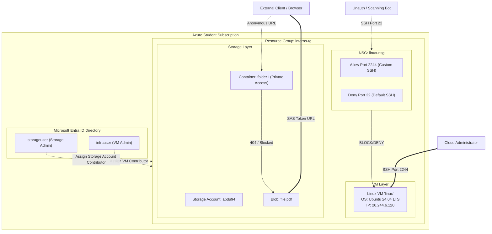

# Minor Project: Implementing Basic Cloud Security Controls in Microsoft Azure

**Author:** Cloud Security Analyst  
**Date:** July 5, 2026  
**Scenario:** XYZ Solutions - Secure Cloud Migration & Lab Environment Deployment  

---

## Executive Summary
This report documents the design, deployment, and hardening of a secure cloud infrastructure in Microsoft Azure for **XYZ Solutions**. The primary objective of this project is to implement robust security controls that safeguard virtual machines, manage user identity and access, and secure unstructured data storage in accordance with cloud security best practices.

The deployed infrastructure comprises:
1. **Hardened Virtual Machine:** A Linux-based VM configured to run SSH on a non-standard port (2244) with Network Security Group (NSG) rules restricting administrative access.
2. **Identity & Access Management (IAM):** Role-Based Access Control (RBAC) configurations implementing the Principle of Least Privilege (PoLP) and segregation of duties.
3. **Secure Blob Storage:** An Azure Storage Account with public network access restricted, container permissions set to Private, and temporary read access delegated via Shared Access Signature (SAS) tokens.

---

## Section A: Theory Assessment

### Question 1: Explain the Shared Responsibility Model in cloud computing.
The **Shared Responsibility Model** is a foundational security framework that delineates the security obligations of the cloud service provider (CSP - e.g., Microsoft Azure) and the cloud customer. Security responsibilities vary based on the deployment model (IaaS, PaaS, SaaS) as detailed below:

*   **Infrastructure as a Service (IaaS):** The cloud provider secures the physical infrastructure (datacenters, physical servers, hypervisors, and physical networks). The customer is responsible for configuring and securing the operating system, network firewalls (NSGs), middleware, runtimes, applications, identity/access management (IAM), and all stored data.
*   **Platform as a Service (PaaS):** The provider manages the physical infrastructure, hypervisor, OS, and runtime environments. The customer shares security configuration options (such as firewall rules and connection strings) and remains fully responsible for their application code, data, and access management.
*   **Software as a Service (SaaS):** The provider is responsible for the entire stack, including application security and system availability. The customer is only responsible for managing users, identities, access policies, endpoints (devices), and data governance.

> [!IMPORTANT]
> **Data, Identity, and Endpoints** are *always* the customer's responsibility, regardless of the cloud service model.

---

### Question 2: What is the Principle of Least Privilege (PoLP) and why is it important?
The **Principle of Least Privilege (PoLP)** dictates that users, applications, system components, and processes must only be granted the minimum level of access (permissions) necessary to perform their specific job functions.

**Why PoLP is Critical in Cloud Security:**
1.  **Blast Radius Reduction:** If an identity is compromised, the attacker's capabilities are restricted only to the scope of that specific account. An attacker cannot escalate privilege to access other sensitive resources.
2.  **Mitigation of Insider Threats:** It prevents users from accidentally or intentionally modifying, deleting, or viewing data/configurations outside their scope of work.
3.  **Regulatory Compliance:** Least privilege access aligns with strict compliance standards (e.g., ISO 27001, SOC 2, HIPAA) which mandate strict access control and separation of duties.

---

### Question 3: Differentiate between Public Blob Storage and Private Blob Storage.

| Parameter | Public Blob Storage | Private Blob Storage (Secure Default) |
| :--- | :--- | :--- |
| **Authentication Requirement** | None (Anonymous access enabled). | Authentication required via Entra ID, SAS Token, or Storage Account Access Keys. |
| **Access URL Method** | Directly accessible via internet browser using standard HTTP/HTTPS URLs. | Direct URLs result in access denial (404/403 errors) unless authentication tokens are appended. |
| **Typical Use Case** | Serving public assets like website images, public documentation, or software binaries. | Storing sensitive company files, code backups, log directories, and internal databases. |
| **Security Risk** | High. Data is exposed to automated web-crawlers and malicious external actors. | Low. Protected by Azure security boundaries and administrative access controls. |

---

### Question 4: What is the purpose of a SAS Token in Azure Storage?
A **Shared Access Signature (SAS)** token is a secure query parameter appended to an Azure Storage resource URL that grants limited, delegated access to blobs, containers, queues, or file shares. It is used to delegate read, write, list, or delete capabilities to external clients without exposing the storage account's Master Access Keys.

**A SAS token allows administrators to specify:**
*   **Scope:** The exact resource accessible (e.g., a single blob or an entire container).
*   **Permissions:** Allowed actions (e.g., Read-only, Write-only, List, Delete).
*   **Time-bound Expiry:** Start and end times during which the token is valid.
*   **Network Restriction:** Client IP addresses allowed to use the token.
*   **Allowed Protocols:** Requiring HTTPS only to prevent interception.

---

### Question 5: Explain the role of Microsoft Sentinel in cloud security.
**Microsoft Sentinel** is a cloud-native Security Information and Event Management (SIEM) and Security Orchestration, Automation, and Response (SOAR) platform. It provides intelligent security analytics and threat intelligence across the enterprise.

**Key Roles in Cloud Security:**
1.  **Data Collection:** Collects logs and telemetry at cloud scale across all users, devices, applications, and infrastructure, both on-premises and in multiple clouds.
2.  **Threat Detection:** Uses analytics rules, machine learning, and Kusto Query Language (KQL) queries to identify security threats and anomaly indicators.
3.  **Incident Management & Investigation:** Aggregates alerts into manageable incidents and provides visual investigation graphs to trace the root cause and lateral movement of an attack.
4.  **Automated Response (SOAR):** Orchestrates threat responses using automated playbooks (Azure Logic Apps) to block malicious IPs, suspend compromised user accounts, or trigger internal alerts.

---

### Question 6: What is the difference between Azure Monitor and Microsoft Sentinel?

*   **Azure Monitor** is an **operations and performance monitoring** tool. It collects metrics and diagnostic logs from Azure resources to track system availability, health, CPU/memory performance, network throughput, and application failures. Its primary users are DevOps engineers, system administrators, and site reliability engineers (SREs).
*   **Microsoft Sentinel** is a **security monitoring and incident response** tool (SIEM). It ingests logs collected by Azure Monitor (Log Analytics Workspace) and security logs from other security appliances to detect cyber threats, identify brute-force attacks, analyze user behavior, and automate incident response. Its primary users are Security Operations Center (SOC) analysts and threat hunters.

---

## Section B: Practical Implementation

### Lab Architecture Diagram
Below is the architectural mapping of the secured cloud environment deployed for XYZ Solutions:



---

### Task 1: Secure Virtual Machine Deployment & Hardening
The objective of this task was to deploy a Linux Virtual Machine and harden its administrative SSH access.

**Configuration Details:**
*   **VM Name:** `linux`
*   **Resource Group:** `interns-rg`
*   **Region:** Central India (initially SUSE Linux Enterprise Server 15.5; finalized as Ubuntu 24.04.4 LTS)
*   **Size:** Standard B2als v2 (2 vCPUs, 4 GiB memory)
*   **Public IP Address:** 20.244.6.120
*   **SSH Custom Port:** 2244 (changed from standard port 22)
*   **Authentication:** SSH Private Key (`linux_key.pem`)

#### Step-by-Step Implementation Evidence:
1.  **Virtual Machine Provisioning:** The virtual machine was provisioned in the resource group `interns-rg` and was verified in running status.
    
    *Figure 1: Azure Portal interface listing the Virtual Machine inventory in running status.*

    
    *Figure 2: Essentials panel displaying details of the 'linux' VM including its public IP address (20.244.13.133) and resource group.*

2.  **Initial Connection Baseline (Default Port 22):** Initial connectivity was tested and confirmed using default SSH port 22 before applying port hardening rules.
    
    *Figure 3: Connection diagnostic proving that default SSH port 22 was open and responsive to baseline connections.*

    
    *Figure 4: SSH session established on the SLES VM using the default port 22.*

3.  **SSH Configuration Hardening:** The SSH daemon configuration (`sshd_config` / `ssh.socket`) was modified inside the VM to bind to custom port 2244 instead of 22. In the Azure portal network settings, a custom rule was added to allow inbound traffic on TCP port 2244. Subsequently, the default SSH port 22 inbound rule was removed.
    
    *Figure 5: Creating the inbound rule in 'linux-nsg' to open port 2244 for TCP.*

    
    *Figure 6: Network security group inbound rules listing custom SSH (2244) allowed with priority 1009 and default SSH rules removed.*

4.  **Verification of Port Access Restriction:** Attempting to connect via the custom port 2244 prior to completing the daemon restart or with port 22 blocked resulted in a connection error, validating that the firewall block is active.
    
    *Figure 7: Terminal console showing 'Connection refused' indicating port block on port 22.*

    
    *Figure 8: Connection troubleshoot tool showing successful network path to port 2244.*

    
    *Figure 9: Successful secure connection to the hardened VM on custom port 2244 (operating SLES/Ubuntu).*

---

### Task 2: Identity & Access Management (IAM) and RBAC
The objective of this task was to configure and test Azure Role-Based Access Control (RBAC) to ensure separation of duties and prevent cross-resource administrative leakage.

**Configuration Details:**
*   **Resource Group Scope:** `interns-rg`
*   **User 1 (Infrastructure Admin):** `infrauser` (Assigned: `Virtual Machine Contributor` + `Network Contributor`)
*   **User 2 (Storage Admin):** `storageuser` (Assigned: `Storage Account Contributor`)

#### Step-by-Step Implementation Evidence:
1.  **User Provisioning in Microsoft Entra ID:** Both user accounts (`infrauser` and `storageuser`) were created within the Microsoft Entra ID tenant.
    
    *Figure 10: Entra ID users overview interface showing both accounts successfully provisioned.*

2.  **Role Assignments at Resource Group Scope:** Roles were assigned under IAM controls of the resource group `interns-rg`.
    
    *Figure 11: Assignment of the Virtual Machine Contributor role to 'infrauser' at the resource group level.*

    
    *Figure 12: Assignment of the Storage Account Contributor role to 'storageuser' at the resource group level.*

3.  **RBAC Access Validation:**
    *   **infrauser Validation:** Logged in as `infrauser`. The interface displayed full administration permissions on the Virtual Machine `linux` (including start, stop, and settings editing). However, attempting to view storage resources resulted in access denial.
        
        *Figure 13: Access denied prompt displayed when 'infrauser' attempts to view or manage storage account settings.*

    *   **storageuser Validation:** Logged in as `storageuser` via an isolated incognito browser tab. The user was able to browse, create containers, and generate tokens on storage account `abdu94`. However, accessing the Virtual Machine panel resulted in access denied or empty resource views.
        
        *Figure 14: Access denied screen when 'storageuser' attempts to view or interact with the virtual machine.*

---

### Task 3: Secure Storage Account & SAS Access Configuration
The objective of this task was to deploy a secure storage account, configure a private container, block public anonymous access, and delegate temporary access via time-bound Shared Access Signatures.

**Configuration Details:**
*   **Storage Account Name:** `abdu94`
*   **Resource Group:** `interns-rg`
*   **Region:** South India
*   **Container Name:** `folder1`
*   **Container Access Level:** Private (no anonymous access)
*   **Uploaded File:** `file.pdf` (or sample file)
*   **SAS Permissions:** Read-only (time-bound from 8:20 PM to 4:20 AM, signed with Key 1)

#### Step-by-Step Implementation Evidence:
1.  **Storage Account & Private Container Creation:** The storage account `abdu94` was provisioned and a blob container named `folder1` was added with its access level set to Private.
    
    *Figure 15: Essentials dashboard of Storage Account 'abdu94' in South India.*

    
    *Figure 16: Adding container 'folder1' with its public access level set explicitly to Private.*

2.  **File Upload & Disabling Public Access:** A sample file was uploaded to the container. The public container level access was verified as blocked.
    
    *Figure 17: Container blob explorer showing 'file.pdf' successfully uploaded.*

3.  **Public Access Denial Validation:** When attempting to access the file using its direct, unauthenticated public URL (`https://abdu94.blob.core.windows.net/folder1/file.pdf`), the request was blocked by Azure.
    
    *Figure 18: Browser showing the XML access denied error, confirming that anonymous access is prevented.*

4.  **SAS Token Generation & Access Validation:** A Shared Access Signature (SAS) token was generated at the blob level, granting Read permission for a limited duration.
    
    *Figure 19: Configuring the SAS token parameters including Read permissions and specific start/end timestamps.*

    
    *Figure 20: Browser successfully rendering the PDF document when accessed via the generated SAS token URL.*

---

## Section C: Security Analysis

### Storage Security Analysis
1.  **Why was a private container used?**  
    A private container restricts access to authorized identities only. Storing development code, design blueprints, or company documents in a public container exposes the startup to critical risk, including data leakage, intellectual property theft, and corporate espionage. Using private containers is the primary preventive control to establish a secure data perimeter.
2.  **Why was SAS chosen instead of public access?**  
    SAS URLs provide granular, managed, and temporary delegation of access. It allows external developers or stakeholders to access specific files without granting them permanent accounts or exposing the root Storage Account access keys. If a SAS token is leaked, its limited validity (time-bound) and strict permissions (Read-only) reduce the potential impact. Additionally, access keys can be rotated to instantly invalidate existing SAS tokens, which is impossible with public anonymous files.

### Virtual Machine Security Analysis
1.  **Why are NSG rules important?**  
    Network Security Groups (NSGs) act as virtual firewalls at the subnet and network interface (NIC) levels. By default, internet-exposed virtual machines are scanned by threat bots within minutes of deployment. NSGs allow administrators to define explicit access controls, blocking malicious traffic before it reaches the VM's operating system network stack.
2.  **What risks are reduced by restricting inbound access?**  
    *   **Brute-Force & Credential Stuffing:** Restricting SSH access to custom port 2244 and source IP ranges blocks 99% of automated dictionary attack scripts targeting port 22.
    *   **Exploitation of Zero-Day Vulnerabilities:** If a service has an unpatched vulnerability, blocking inbound traffic to that service prevents external exploitation.
    *   **DDoS & Network Scans:** Limiting open ports reduces the visible attack surface of the network footprint, making the infrastructure less susceptible to scanning and resource exhaustion.

---

## Recommendations & Future Actions

To further enhance the cloud security posture of XYZ Solutions, we recommend implementing the following security controls:

### 1. Enable Just-In-Time (JIT) VM Access
*   **Description:** Just-In-Time access (configured via Microsoft Defender for Cloud) keeps management ports (like SSH port 2244) closed by default. When an administrator needs access, they request it through the Azure portal. If approved, Defender for Cloud temporarily opens the port for the admin's specific source IP and automatically closes it after a set duration (e.g., 3 hours).
*   **Security Value:** This effectively reduces the exposed management attack surface to zero during idle periods.

### 2. Implement Microsoft Sentinel SIEM Integration
*   **Description:** Integrate the Log Analytics Workspace (`LAB-LAW`) with Microsoft Sentinel. Configure a Data Collection Rule (DCR) to collect authentication logs (`/var/log/auth.log` or Windows Event Logs) and set up a KQL-based analytic alert rule.
*   **KQL Threat Query Example (Failed Logins):**
    ```kusto
    Syslog
    | where ProcessName == "sshd" and SyslogMessage has "Failed password"
    | summarize FailedAttempts = count() by SourceIP = extract("from ([0-9.]+)", 1, SyslogMessage), Computer, TimeGenerated
    | where FailedAttempts > 5
    ```
*   **Security Value:** Provides real-time detection and automated containment of brute-force and credential-stuffing attacks.

### 3. Enforce Multi-Factor Authentication (MFA) & Conditional Access
*   **Description:** Apply Microsoft Entra ID Conditional Access policies requiring MFA for administrative accounts like `infrauser` and `storageuser`.
*   **Security Value:** Ensures that even if the administrative passwords are leaked or brute-forced, attackers cannot access the Azure Portal without passing secondary verification (such as the Microsoft Authenticator App).

### 4. Implement Storage Firewall & Private Endpoints
*   **Description:** Disable public network access to storage account `abdu94` entirely. Restrict access to designated corporate virtual networks or public administrative IP ranges.
*   **Security Value:** Ensures that even with a valid SAS URL, the data cannot be accessed from unauthorized network locations, establishing a zero-trust network boundary.
